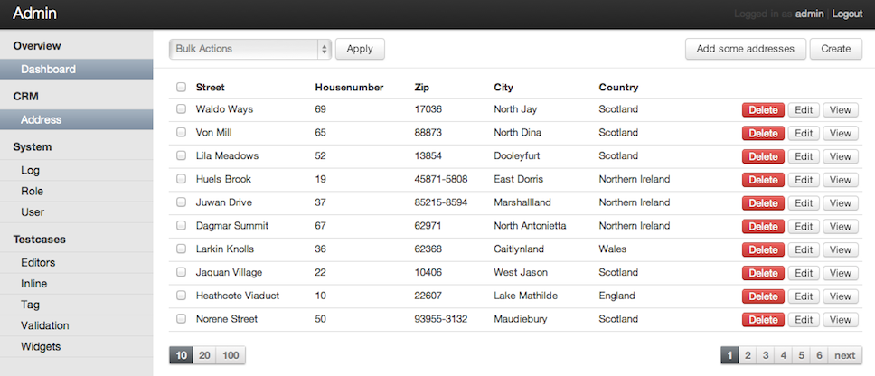

#Automatic Administration Interface for FLOW3
This Packages tries to provide a Base to have basic CRUD Operations with a good User  Interface and Experience with the least effort and code as Possible, because i believe, that, the DRY principle should be Used for the GUI of your application as much as Possible as Well. In Principle you only need to specify one Tag called @Admin\Annotations\Active in your Model's
class and this Admin package will take care of the rest. Every other Option is optional to optimize the Experience of the GUI. For Maximum Flexibility and Versatility a System of Fallback Mechanisms is in place to override the Default Template.

##Features
- Create and Update Items
	- Appropriate Widgets for Various Data Types
		- String, Integer, Float -> Textfield
		- Boolean -> True/False Selector
		- Single Relation -> Selectbox
		- Multiple Selection -> Special Selectbox with multiple Selection Support 
		- DateTime -> Textfield with DatePicker enhanced
		- Ressource -> Upload Input
- Delete Items 
- List View
	- Basic List in tabular form
	- Simple Filter Mechanism using a Selectbox 
	- Bulk Actions
		- Delete included 
- Single View
	- Dummy View to show an Models Data on a seperate Page 
- Security
	- User and Roles Management 
	- Finely grained Rights Management